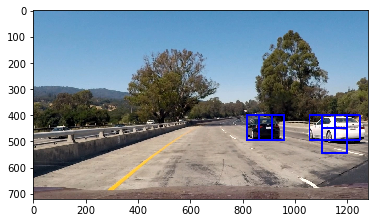
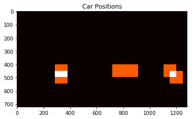
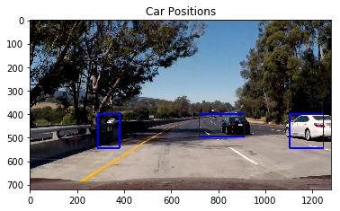

# Vehicle Detection
### Goal of the projects:- To Detect Cars on the Road
The Algorithm used in the programme uses hog features,Histograms features.

To Know more about Hog and Histogram feature look into the data_explore.ipynb file.
The Project Steps were as follows:-

##### Step:-1:Loading Sample data sets to train classifier
The datasets were extracted form udacity datasets into the programme to train the classifier.
**Random Images Displayed From Datasets**
	
### Step 2:- Analysing Certain Features of the datasets
**HOG_Feature**
Exratacting Hog Features by calling hog_function

Similarly calling respective functions to Analyse Histogram and Spatial features of the image
### Step 3:- Creating Datasets of all the classified features to train the classifier
###Step 4:-Using Sklearn library to train the classifier
###Step 5:- Using Window Sliding and Window Search Technique To Search and Perdict the images for car/non-cars using the classifier
###Step 6:-Drawing the boxes on the Predicted Images
###Step 7:-Using Heatmap function to make sure the image predicted is of a car

### Image Examples
**Step 6:Image Prediction Example**

**Step 7:Heat Maps Image Example**

**Histogram Features image Graph**

**Spatial Images**

> test_results:- Test Video
> project_result:- Project Video