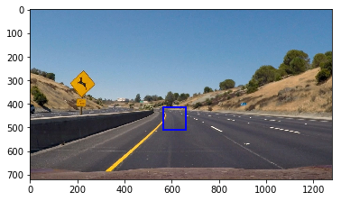

# Vehicle Detection
Project Writeup

### Steps Taken To Complete the Project

We Used HOG-Features and Histogram features of the image to Identify the car in the image/video.So,we first analysed the image data(refer to data_explore)to identify the properties of the images in HOG channel and Histogram Channel.

#### WHY HOG -CHANNEL
Histogram of oriented gradients (HOG) is a feature descriptor used to **detect objects in computer visionand image processing**. The HOG descriptor technique counts occurrences of gradient orientation in localized portions of an image - detection window, or region of interest (ROI).
##### IMPLEMENTATION METHOD

Implementation of the HOG descriptor algorithm is as follows:-

- Divide the image into small connected regions called cells, and for each cell compute a histogram of gradient directions or edge orientations for the pixels within the cell.
- Discretize each cell into angular bins according to the gradient orientation.
- Each cell's pixel contributes weighted gradient to its corresponding angular bin.
- Groups of adjacent cells are considered as spatial regions called blocks. The grouping of cells into a block is the basis for grouping and normalization of histograms.
- Normalized group of histograms represents the block histogram. The set of these block histograms represents the descriptor.
##### HOG IMAGE

**Code Description**

Function Created for fetching Hog feature in the code :-
**get_hog_features(image,oreintation,pixels per cell,cell per block,vis='True/False',feature_vector='True/False')**
argument details is as follow:

- image(image data extracted by using mpimg.imread)
- oreinetation(image oreintation value)
- pixels per cell(no of pixels to be searched per cell)
- cell per block(no of cell to created per block to search for features)
- vis(Value Parameters-True/False)
- feature_vector(Value Parameter -True/False)

##### Step:-1:Loading Sample data sets to train classifier

The datasets were extracted form udacity datasets into the programme to train the classifier.
**Random Images Displayed From Datasets**
	

### Step 2:- Analysing Certain Features of the datasets
**HOG_Feature**
Exracting Hog Features by calling hog_function

##### HOG IMAGE

Similarly calling respective functions to Analyse Histogram and Spatial features of the image

**Histogram Features**
In this all the features of color is analysed ie if the image is in RGB form -Then each R,G,B features are extracted so that our classifeir can predict efficiently.

**Example of Sample Image Through Graph**

**BinSpatial Feature**
Used to Convert the images to 32X32 size image so that data sets can be closely be associated with our training size images and identify the image associated with car more efficiently 

**Spatial Images**

### Step 3:- Creating Datasets of all the classified features to train the classifier And Training The Classifier
We extracted all the features(HOG,Histogram and spatial) from non-car and car data sets and trained our classifer using sklear SVM classifier.Parameter for SVM was linear classifier with 20 percents of the data classified as Test Data and 80 percent of the data classified as train data.

**Accuracy Achieved**
> 6.11 Seconds to train SVC...
Test Accuracy of SVC =  0.9828
My SVC predicts:  [ 1.  1.  0.  1.  1.  1.  0.  1.  1.  0.  0.  0.  0.  0.  1.  1.  1.  0.
  1.  1.]
For these 20 labels:  [ 1.  1.  0.  1.  1.  1.  0.  1.  1.  0.  0.  0.  0.  0.  1.  1.  1.  0.
  1.  1.]
0.10939 Seconds to predict 20 labels with SVC

###Step 4:- Using Window Sliding and Window Search Technique To Search and Perdict the images for car/non-cars using the classifier.
We then used sliding-window function to extract image features(with various paramenters like 64by 64 or any value) so that our window search function can search for the specific features of car in the image and return the positions so that the boxes can be drawn.Thus,helping us in identifing cars in the image.

**We used various parameter for window slide function about 2 to 3 times so that our classifer can accuractly predict car boxes.Though there were still some false predictions**

Henceforth to rectify the false prediction we used the method of heatmaps   

Results Examples:-

 
###Step 5:-Using Heatmap function to make sure the image predicted is of a car
We used heat maps parameters to remove all the flase predcitions made by the classifier.This method was helpful in removing all the false predictions.

Example of the image heatmaps

> Note:- In video we used 30 frames to draw heatmaps and identify cars in the images.
 
>Discussion:- The prediction still can be improvement to reach perfection.

> test_results:- Test Video
> project_result:- Project Video

#### Problem Faced:-

- Setting Parameters for Hog Features was the most difficult task as various paramaters gave various results.Adjusting this parameters was the most time consuming task.
- Training The Classifier with specific features and drawing boxes by classifer predictions was second in line that consumed most of the time in the project.
"Since there were number of paramaters like sliding window function for stronger predictions of car image had to done made the task time consuming(following Parameters were used(128,128),(64,64),(32,32),(96,96)"

